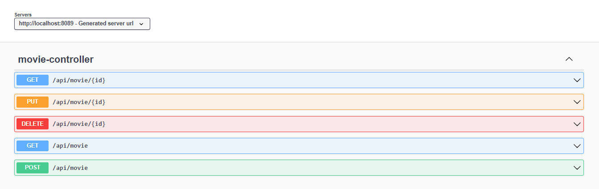

# Spring Bboot AWS localstack dynamodb
 
 ### Requisitos
 - Java 11
 - Maven
 - Docker
 - Docker-compose

 ### Instruções
 - Clonar o projeto
 - Rodar __docker-compose up -d__ na raiz do projeto para levantar o container do Localstack e icializar o dynamosdb com a table movies, tudo esto na pasta init-script
 - Rodar o projeto Spring boot
 - Acessar [http://localhost:8089/swagger-ui](http://localhost:8089/swagger-ui) para ver a documentação e da API e testar

 * Espero que ajude você
